> **Story Runtime Linux 开发交付入口：** [启动与使用说明](STORY_RUNTIME_LINUX_README.md)。运行 `./start-story-runtime-linux.sh` 启动独立 WorldMode；下面保留原 DSH Tavern 上游说明。新入口不启动原默认宽权限工具 profile。

<p align="center">
  <picture>
    <source media="(prefers-color-scheme: dark)" srcset="https://raw.githubusercontent.com/flizzywine/dsh-tavern/main/docs/assets/brand/dsh-tavern-lockup-on-dark.svg">
    
  </picture>
</p>

# DSH Tavern

**基于 DSH（DeepSeek Harness）的 Agent 酒馆。兼容 SillyTavern 生态，人物卡导入就能玩。**

更快 · 更稳 · 更鲜活 · 所有模型都能用 · 手机也能玩

[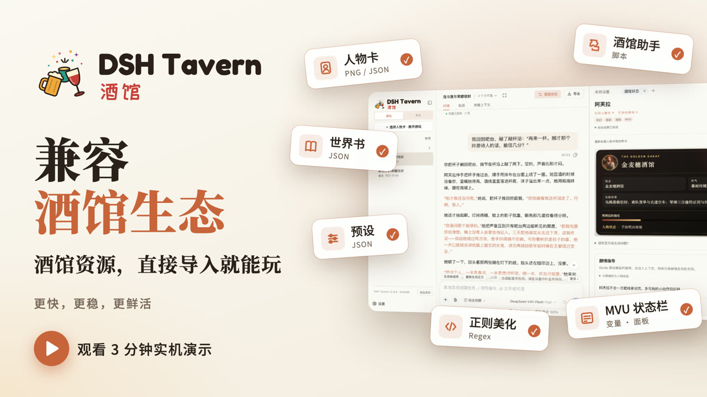](https://www.bilibili.com/video/BV1MHaU6NE7S/)

[下载安装](#快速开始) · [使用文档](https://flizzywine.github.io/dsh-tavern/) · [宣传视频](https://www.bilibili.com/video/BV1MHaU6NE7S/) · [讨论区](https://github.com/flizzywine/dsh-tavern/discussions) · [Discord](https://discord.com/channels/1134557553011998840/1538577327028445194)

- **兼容 SillyTavern 生态**：人物卡、世界书、预设、正则美化、MVU、酒馆助手脚本，导入就能用。
- **更快**：一轮约 10 秒，缓存命中率 95% 以上。
- **更稳**：状态栏不再掉格式。变量由后台按规则结算，每轮附更新结果，失败可单独重试；更新与重装都保留数据。
- **更鲜活**：同样的模型、同样的预设，比原版酒馆更有活人感。因为前台模型只管写正文，变量结算等任务性工作交给后台模型。
- **手机也能玩**：Android 手机直接安装；电脑上运行的酒馆，手机扫码就能远程游玩。

## SillyTavern vs DSH Tavern

|           | SillyTavern                               | DSH Tavern                                                                                                  |
| --------- | ----------------------------------------- | ----------------------------------------------------------------------------------------------------------- |
| **上手门槛**  | ❌ 要自己配预设、正则、扩展，学习门槛高                      | ✅ 填好模型、导入人物卡就能玩，默认无需外部预设                                                                                    |
| **工作方式**  | ❌ 一口气：一个模型在一次请求里完成所有事                     | ✅ 分步：正文、变量结算、候选项各自完成                                                                                        |
| 出错重来      | ❌ 整轮重新生成，满意的部分也一起丢掉                       | ✅ 哪步出错重来哪步，正文和候选还能附上指导意见                                                                                    |
| 正文        | ❌ 写正文的同时要记住各种格式要求，注意力被分散                  | ✅ 前台专心写正文                                                                                                   |
| 状态栏       | ❌ 每一轮都要求模型重新输出状态栏，写长了容易掉格式                | ✅ 状态栏固化：MVU 版由固定模板按变量显示，不再由模型输出，绝对不会掉格式                                                                     |
| 候选项       | ❌ 写正文的同时还要兼顾生成候选项，注意力涣散，还可能掉格式            | ✅ 和正文任务拆分，专注生成候选项；通过工具提交并校验，显示在固定面板，绝对不会掉格式                                                                 |
| **剧情规划**  | ❌ 没有剧情规划，走向全靠模型临场发挥                       | ✅ 多种方式规划剧情：<br>① 剧本模式，沿剧本主线发展<br>② 注入 Guide，临时规划剧情走向<br>③ 候选项自动规划下一步，避免剧情停滞                                 |
| **记忆**    | ❌ 靠压缩总结提前猜测需要什么记忆，提前注入，难以预测真实需求           | ✅ 内置记忆检索工具，需要什么记忆，Agent 自行检索原文                                                                              |
| 缓存与速度     | ❌ 未考虑缓存利用：世界书条目内容一变化，缓存就失效                | ✅ 缓存命中率 95% 以上，一轮约 10 秒                                                                                     |
| 写作方法      | ❌ 写进预设，每轮常驻提示词                            | ✅ 写成 Skill，按场景调用                                                                                            |
| **边玩边改卡** | ❌ 想排错或按喜好调整，都要自己翻人物卡、世界书、正则，逐项手改          | ✅ 边玩边改：<br>① 排查错误：有问题随时交给调试 Agent，结合实际游玩记录分析并修复<br>② 调整内容：用对话告诉 Agent 哪里不喜欢，按自己的口味微调                        |
| **酒馆生态**  | ✅ 生态极其丰富：人物卡、世界书、预设、正则、MVU、酒馆助手脚本、大量第三方插件 | ✅ 兼容大部分人物卡（包括 MVU、正则、酒馆助手脚本、前端美化），世界书、预设可直接导入<br>⚠️ 不支持安装酒馆插件（DSH 插件可以装），但内置了酒馆助手、MVU、提示词模板等重要插件，足以支撑大部分人物卡 |

## 产品特色

### 剧本模式

导入小说、剧本或大纲，绑定到人物卡，就能走进原作亲历主线。剧本定方向和关键事件，你决定人物怎么走到那里，随时可以偏离。剧本按片段读取，再长的小说也不用整本塞进上下文。[了解更多 →](https://flizzywine.github.io/dsh-tavern/#c01)

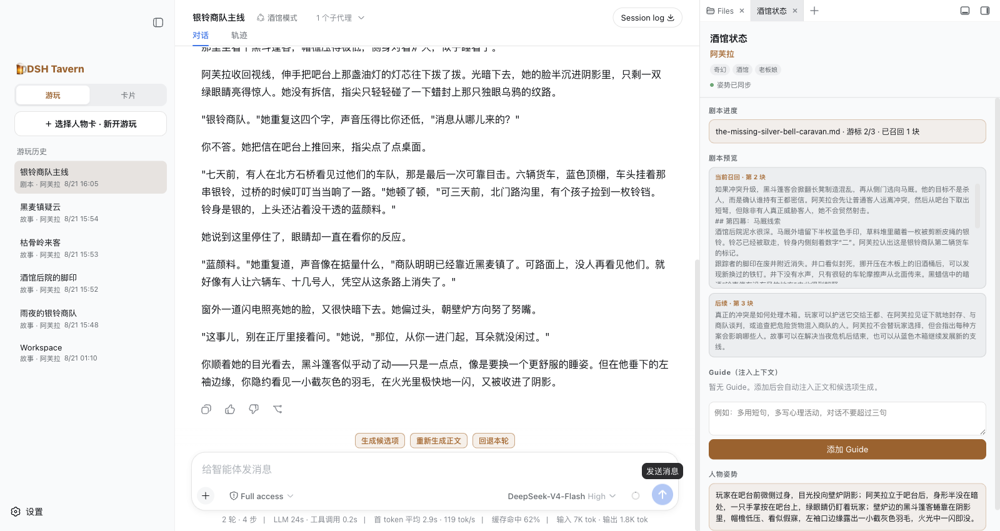

### 长期记忆

每轮正文完整保存，Agent 需要时自己回查原文，不靠摘要硬记；配合上下文压缩，玩到几百层仍能记起开局的细节。[了解更多 →](https://flizzywine.github.io/dsh-tavern/#d06)

### 对话式修改人物卡

不用懂卡片字段，告诉 Agent 哪里不喜欢、想改成什么样，它先给方案，你确认后才写入。也能从小说里提取人物做新卡，或用同样方式修改世界书和预设。[了解更多 →](https://flizzywine.github.io/dsh-tavern/#h04)

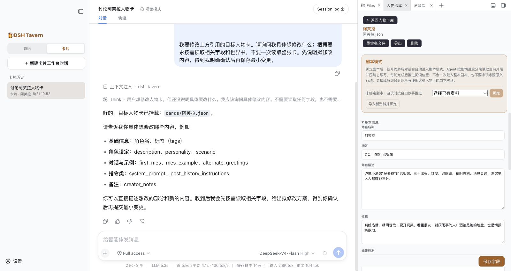

### 人物卡转 MVU 版，状态栏不再掉格式

正文里的状态栏老是掉格式？让 Agent 把人物卡转成 MVU 版：前台只写正文，变量由后台按规则结算，状态栏常驻右侧，原卡图片和设定都保留。[了解更多 →](https://flizzywine.github.io/dsh-tavern/#h07)

### 自助调试 Agent

正则没生效、美化显示不对、状态栏没更新？在右侧点「交给卡片 Agent 调试」，Agent 会读取这局的实际游玩记录和日志，分析原因并修改相关资源，不用自己翻配置猜问题。[了解更多 →](https://flizzywine.github.io/dsh-tavern/#h08)

### Guide：给这一局注入上下文指引

想要的写法、节奏或剧情走向写成一条 Guide，比如“多写心理活动，对白不超过三句”“好感度涨得慢一点”。它会注入上下文，之后每轮正文、候选和变量结算都会参考，不用每次重复。[了解更多 →](https://flizzywine.github.io/dsh-tavern/#b09)

### 带意见重写

不满意这轮回复，写上哪里要改，比如“保留事件，但减少旁白解释”，只重写这一轮，比反复抽卡更可控。[了解更多 →](https://flizzywine.github.io/dsh-tavern/#b07)

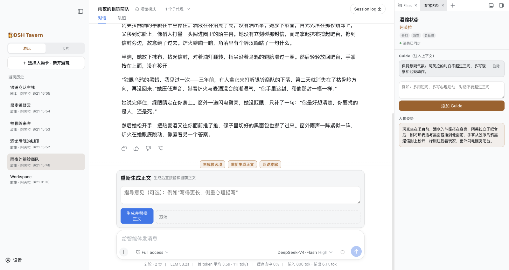

### 后台人物设计

重要人物登场时，后台为其设计完整档案：动机、性格、外貌、说话方式、与主角的关系，之后反复出场都按同一套设定来，不会前后走样。已有设定直接复用，不重复造人。[了解更多 →](https://flizzywine.github.io/dsh-tavern/#d10)

### 写作 Skill

把写作教程或喜欢的样文交给 Agent，提炼成场景写作 Skill，比如打斗、悬疑、感情戏各有一套写法；游玩时模型按场景自动选用。[了解更多 →](https://flizzywine.github.io/dsh-tavern/#m04)

### 支持 DSH 插件生态

酒馆运行在 DSH 上，可以自行安装其他 DSH 插件一起使用，例如手机访问的 [dsh-pocket](https://github.com/shaobeichen/dsh-pocket)、远程登录认证的 [dsh-webui-auth](https://github.com/Yuuz12/dsh-webui-auth)、语音朗读插件等。缺什么能力，也可以让 Agent 帮你写一个自定义工具。[了解更多 →](https://flizzywine.github.io/dsh-tavern/#m07)

## 看看实际效果

**MVU 状态栏**：人物状态随剧情变化，正文下方可查看本轮更新了什么。

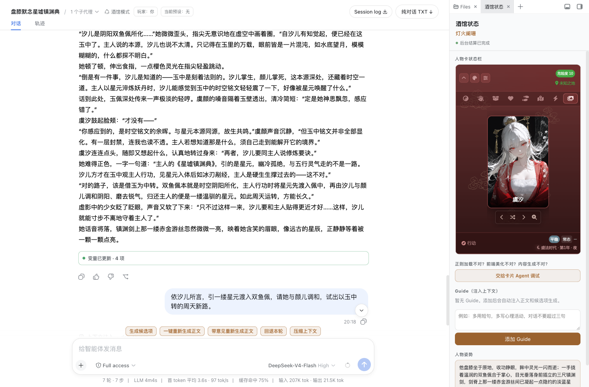

**小手机**：边读剧情，边看角色发来的消息。

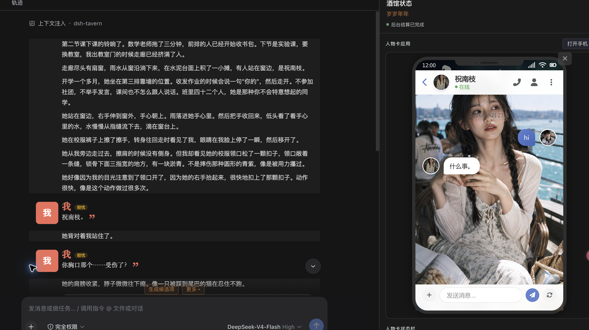

**场景插画**：为当前剧情配一张图。

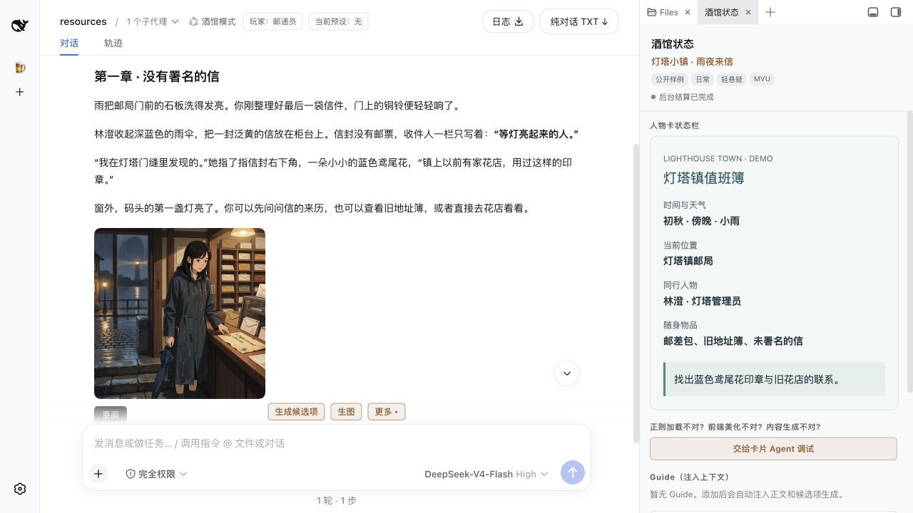

## 快速开始

### Windows

**方式一：一键安装包（推荐）**

**[下载 Windows 安装包](https://github.com/flizzywine/dsh-tavern/releases/download/v2.4/DSH-Tavern-Desktop-2.0.13-x64-Setup5.exe)**（x64），双击运行，保持联网，按提示完成。以后从桌面「DSH Tavern」快捷方式打开，无需另装 Node.js 或 DSH Desktop。[图文教程 →](https://flizzywine.github.io/dsh-tavern/#a02--section-2)

**方式二：借助 DSH Desktop**

先安装 **[DSH Desktop 2.0.13](https://github.com/anywhere-labs/dsh-desktop/releases/tag/v2.0.13)**，在 **设置 → 通用设置 → 打开 DSH 终端** 中运行下面的命令，完成后重启 Desktop，选择 **tavern** Profile。[图文教程 →](https://flizzywine.github.io/dsh-tavern/#a02--section-3)

```powershell
$env:DSH_TAVERN_HOST='desktop'; $tavernInstaller=[Text.Encoding]::UTF8.GetString((New-Object Net.WebClient).DownloadData('https://cdn.jsdelivr.net/gh/flizzywine/dsh-tavern@main/install.ps1')); Invoke-Expression $tavernInstaller
```

**方式三：命令行**

需要 **Node.js 22.19+**，在 PowerShell 中运行，安装后自动打开网页，以后用 `dsh-tavern open` 打开。[详细说明 →](https://flizzywine.github.io/dsh-tavern/#a02--section-4)

```powershell
$env:DSH_TAVERN_HOST='cli'; $tavernInstaller=[Text.Encoding]::UTF8.GetString((New-Object Net.WebClient).DownloadData('https://cdn.jsdelivr.net/gh/flizzywine/dsh-tavern@main/install.ps1')); Invoke-Expression $tavernInstaller
```

### macOS

先安装 **[DSH Desktop 2.0.13](https://github.com/anywhere-labs/dsh-desktop/releases/tag/v2.0.13)**，在 **设置 → 通用设置 → 打开 DSH 终端** 中运行：

```bash
curl -fsSL https://cdn.jsdelivr.net/gh/flizzywine/dsh-tavern@main/install.sh | DSH_TAVERN_HOST=desktop sh
```

完成后重启 Desktop，选择 **tavern** Profile。[图文教程 →](https://flizzywine.github.io/dsh-tavern/#a02--section-3)

### Linux

需要 **Node.js 22.19+**，在终端运行：

```bash
curl -fsSL https://cdn.jsdelivr.net/gh/flizzywine/dsh-tavern@main/install.sh | DSH_TAVERN_HOST=cli sh
```

安装后自动打开网页；以后用 `dsh-tavern open` 打开。[详细说明 →](https://flizzywine.github.io/dsh-tavern/#a02--section-4)

### Android

**方式一：一键安装（推荐）**

**[下载 Android APK](https://github.com/flizzywine/dsh-tavern/releases/download/v2.1/dsh-tavern-android-release.apk)**（Android 11+、ARM64），安装后打开，点击启动，首次保持联网等待自动安装完成。[图文教程 →](https://flizzywine.github.io/dsh-tavern/#a02--section-5)

**方式二：借助 DSHA**

已在用 **[DSHA](https://github.com/DSH-APP/DSHA/releases)** 的，可以在 DSHA 中安装并启动酒馆。[图文教程 →](https://flizzywine.github.io/dsh-tavern/#a02--section-6)

### 手机远程访问

酒馆跑在电脑或服务器上，用手机浏览器也能玩。[详细说明 →](https://flizzywine.github.io/dsh-tavern/#a02--section-10)

- **电脑运行、手机扫码**：Desktop 版已自带 [dsh-pocket](https://github.com/shaobeichen/dsh-pocket)，在 **设置 → 手机访问** 选择局域网或公网，扫码即可。
- **服务器部署、账号登录**：安装 [dsh-webui-auth](https://github.com/Yuuz12/dsh-webui-auth)，为远程网页加上登录认证。

### 开始游玩

在 **设置 → 模型** 填入模型服务和 API 密钥（任意模型都可以，本地模型也行），导入人物卡就能开局。[图文教程 →](https://flizzywine.github.io/dsh-tavern/#a02--section-7)

**更新与重装：**在酒馆里点「更新到最新版」即可更新。需要重装时，重新运行原来的安装包或命令，只替换程序，人物卡、聊天和设置都会保留。[详细说明 →](https://flizzywine.github.io/dsh-tavern/#a02--section-9)

安装失败时看[常见故障](https://flizzywine.github.io/dsh-tavern/#a02--section-11)；macOS 命令行安装、已有 DSH 的[插件安装](https://flizzywine.github.io/dsh-tavern/#plugin-installation)等见[完整安装指南](https://flizzywine.github.io/dsh-tavern/#a02)（宿主适配 DSH **0.1.5-rc.2**）。

## 交流与反馈

欢迎交流使用经验、分享人物卡或反馈问题：

- **[GitHub Discussions](https://github.com/flizzywine/dsh-tavern/discussions)**：任何人都可以直接发帖。
- **[Discord 讨论频道](https://discord.com/channels/1134557553011998840/1538577327028445194)**：需要类脑社区成员资格才能进入。

本项目没有 QQ 群、微信群或其他群聊。

反馈故障时，可从对话顶部的“日志”下载执行记录；分享前请检查其中的对话和附件隐私。

## 贡献者与致谢

感谢 [@huajiao1998（meng）](https://github.com/huajiao1998) 持续提交详细的问题报告、复现步骤、性能分析和修复建议，并协助验证改进，帮助完善长会话、后台任务和界面稳定性。

## 用户怎么说

[](docs/images/readme/testimonials/more-alive-and-faster.jpg)

[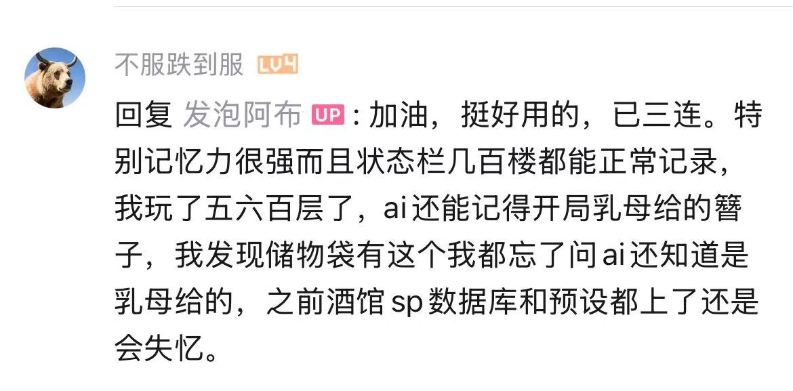](docs/images/readme/testimonials/long-chat-memory.jpg)

[](docs/images/readme/testimonials/long-session-cache-hit.png)

[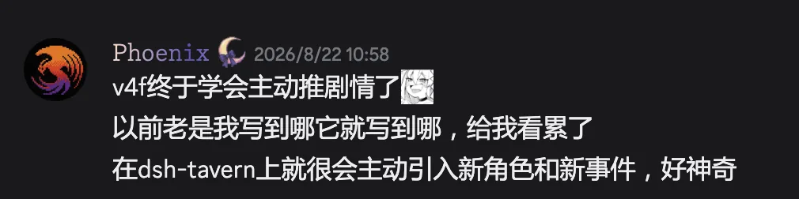](docs/images/readme/testimonials/proactive-story.webp)

<details>
<summary>更多用户反馈</summary>

[](docs/images/readme/testimonials/local-27b.webp)

[](docs/images/readme/testimonials/cache-and-cost.webp)

[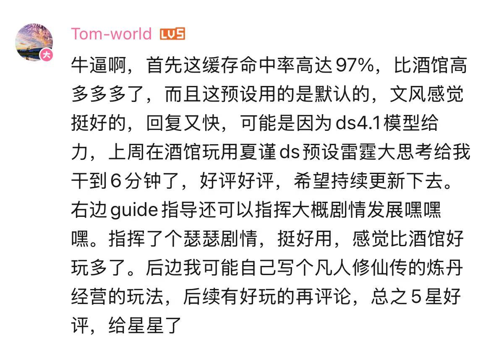](docs/images/readme/testimonials/default-preset-and-guide.jpg)

[](docs/images/readme/testimonials/ease-of-use.webp)

[](docs/images/readme/testimonials/memory-feedback.webp)

[](docs/images/readme/testimonials/chat-feedback.webp)

[](docs/images/readme/testimonials/writing-feedback.webp)

[](docs/images/readme/testimonials/plugin-feedback.webp)

[](docs/images/readme/testimonials/overall-experience.webp)

[](docs/images/readme/testimonials/cache-hit-feedback.webp)

[](docs/images/readme/testimonials/mvu-and-rewrite.webp)

[](docs/images/readme/testimonials/reply-speed.webp)

[](docs/images/readme/testimonials/play-experience.png)

[](docs/images/readme/testimonials/agent-writing-quality.png)

[](docs/images/readme/testimonials/character-card-editing.jpg)

[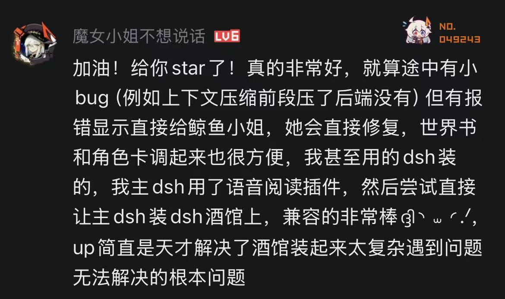](docs/images/readme/testimonials/setup-and-plugin-compatibility.jpg)

[](docs/images/readme/testimonials/ai-editing-and-variable-stability.jpg)

</details>
